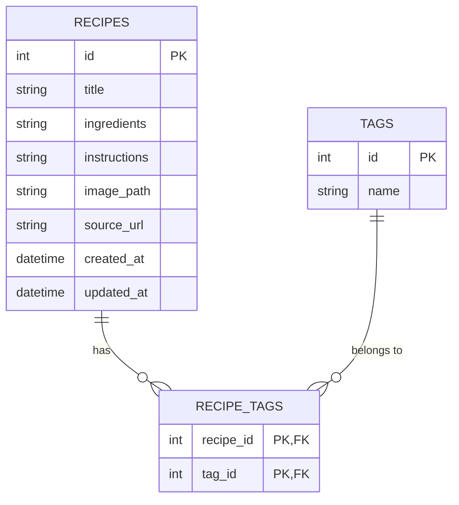

# 資料庫設計 (Database Design) - 食譜收藏夾

## 1. ER 圖（實體關係圖）

## 2. 資料表詳細說明

### recipes (食譜表)
負責儲存食譜的核心資訊。
- `id` (INTEGER): Primary Key, 自動遞增。
- `title` (TEXT): 食譜名稱 (必填)。
- `ingredients` (TEXT): 所需食材清單。
- `instructions` (TEXT): 製作步驟說明。
- `image_path` (TEXT): 圖片在本機檔案系統的相對路徑。
- `source_url` (TEXT): 食譜來源網址。
- `created_at` (DATETIME): 建立時間，預設為當下時間。
- `updated_at` (DATETIME): 最後更新時間，預設為當下時間。

### tags (分類標籤表)
儲存自訂的分類標籤。
- `id` (INTEGER): Primary Key, 自動遞增。
- `name` (TEXT): 標籤名稱 (必填，且不可重複 UNIQUE)。

### recipe_tags (食譜與標籤的關聯表)
處理多對多 (Many-to-Many) 關係的關聯表。
- `recipe_id` (INTEGER): Foreign Key，對應 `recipes.id`，若食譜刪除則自動聯動刪除 (ON DELETE CASCADE)。
- `tag_id` (INTEGER): Foreign Key，對應 `tags.id`，若標籤刪除則自動聯動刪除 (ON DELETE CASCADE)。
- `Primary Key`: 由 `recipe_id` 與 `tag_id` 共同組成複合主鍵。

## 3. SQL 建表語法

位於 `database/schema.sql` 檔案中。

## 4. Python Model 程式碼

我們採用 `sqlite3` 原生套件實作，將連線邏輯與 CRUD 方法分裝至對應的 Model 中。
檔案放置於 `app/models/` 目錄下：
- `db.py`: 管理資料庫連線，並提供 `init_db()` 初始化資料庫方法。
- `recipe.py`: 負責 `recipes` 及關聯標籤的操作 (`create`, `get_all`, `get_by_id`, `update`, `delete`, `add_tags`, `clear_tags`)。
- `tag.py`: 負責 `tags` 的操作 (`create`, `get_all`, `get_by_id`, `delete`)。
