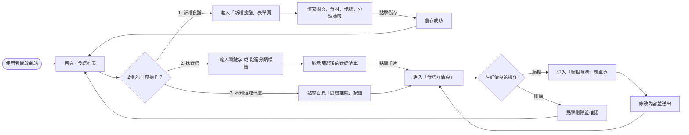
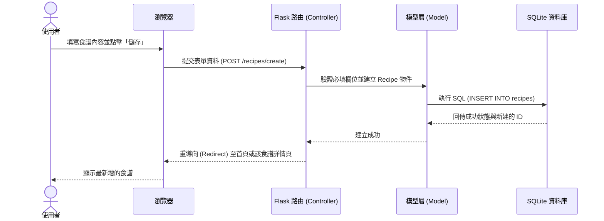

# 流程圖設計 (Flowchart) - 食譜收藏夾

本文件基於 PRD 的需求與 ARCHITECTURE 的設計，視覺化「使用者操作路徑」以及「系統內部資料流」，並列出各功能對應的路由規劃。

## 1. 使用者流程圖（User Flow）

此流程圖描述使用者進入網站後，如何瀏覽、新增、編輯或隨機挑選食譜：

## 2. 系統序列圖（Sequence Diagram）

以下序列圖以 **「使用者新增食譜」** 為例，描述從前端表單送出到後端資料庫寫入的完整資料流：

## 3. 功能清單對照表

根據使用者的操作路徑，以下是系統會實作的頁面路由（URL）與對應的 HTTP 請求方法：

| 功能項目 | 說明 | URL 路徑 | HTTP 方法 |
| :--- | :--- | :--- | :--- |
| **首頁 / 列表** | 顯示所有食譜，包含搜尋關鍵字與標籤過濾邏輯 | `/` | GET |
| **新增表單頁** | 顯示提供使用者填寫新食譜的網頁介面 | `/recipes/new` | GET |
| **處理新增** | 接收表單送出的資料並存入資料庫 | `/recipes/create` | POST |
| **食譜詳情頁** | 顯示單一食譜的完整食材、步驟與圖片 | `/recipes/<id>` | GET |
| **編輯表單頁** | 顯示載入既有資料的表單網頁介面 | `/recipes/<id>/edit` | GET |
| **處理編輯** | 接收表單修改後的資料並更新資料庫 | `/recipes/<id>/update` | POST |
| **處理刪除** | 刪除指定的食譜並導回首頁 | `/recipes/<id>/delete` | POST |
| **隨機推薦** | 隨機挑選資料庫中一筆食譜，並重導向至其詳情頁 | `/random` | GET |

> 註：由於原生 HTML 表單僅支援 GET 與 POST 方法，因此修改（Update）與刪除（Delete）操作在此皆配置為 POST 路由。
